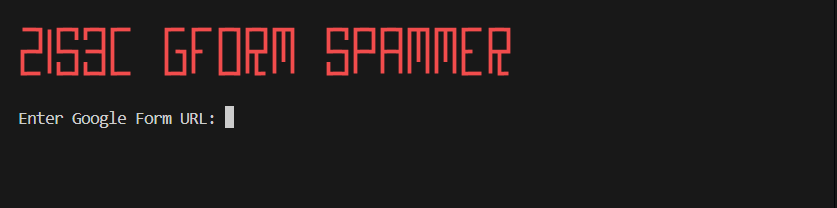

# Google Forms Spammer


<p align="center">
  
</p>

A high-performance, asynchronous Google Forms spammer built with Python and `aiohttp`. Capable of sending thousands of requests concurrently with intelligent 429 (Rate Limit) handling and user-agent rotation.

> [!WARNING]
> **Educational Purposes Only**: This tool is designed for educational purposes and stress testing systems you own. The authors are not responsible for any misuse.

## Features

- 🚀 **High Performance**: Asynchronous architecture allowing massive concurrency.
- 🎨 **Modern UI**: Beautiful, color-coded CLI interface with `rich` tables and panels.
- 🖥️ **Web Configurator**: Built-in web server to visually configure answers for complex forms.
- 🔄 **Smart Handling**: Automatically handles 429 Rate Limits and server errors.
- 🛡️ **Stealth**: Rotates User-Agents to mimic legitimate traffic.
- 🤖 **Auto-Discovery**: Automatically parses form questions (Text, MCQ, Checkboxes, Date, Time).
- 📝 **Validation**: Smart URL validation and retry loops for seamless user experience.
- 💻 **CLI & Interactive**: Run it fully automated via arguments or interactively.

## Installation

1. **Clone the repository**
   ```bash
   git clone https://github.com/zis3c/google-form-spammer
   cd google-form-spammer
   ```

2. **Install dependencies**
   ```bash
   pip install -r requirements.txt
   ```

## Project Structure

```
google-form-spammer/
├── main.py                 # Main CLI - entry point for all modes
├── core.py                 # Async engine - form parsing, request sending, rate-limit handling
├── configurator.py         # Web configurator - local UI for custom answer setup
├── requirements.txt        # Python dependencies
├── preview.png             # CLI/dashboard preview screenshot
├── TOOL_DOCUMENTATION.txt  # Capabilities and awareness guide
└── CONTRIBUTING.md         # Contribution guidelines
```

## Usage

### Interactive Mode
Simply run the script without arguments:
```bash
python main.py
```
Follow the prompts to enter the Form URL. You can choose between:
1. **Random Generation**: Automatically fills fields with plausible data.
2. **Custom Config**: Launches a local Web UI to visually configure specific answers for every question.

### Command Line Interface
To see all available options:
```bash
python main.py --help
```

**Example:**
```bash
python main.py --url "https://docs.google.com/forms/d/e/..." --count 1000 --workers 100
```

| Argument | Description | Default |
|----------|-------------|---------|
| `--url` | The full URL of the Google Form | - |
| `--count` | Number of requests to send | `100` |
| `--workers` | Number of concurrent async workers | `50` |
| `--custom-answer` | Custom text for open-ended questions | Random |
| `--help` | Show the help message and exit | - |

## How It Works

1. **Parsing**: Fetches the form HTML and uses regex to extract the `FB_PUBLIC_LOAD_DATA_` JSON blob, identifying all questions and input fields.
2. **Generation**: Random answers are generated based on question types (MCQ, Checkbox, Text).
3. **Async Engine**: A pool of async workers sends POST requests to the `formResponse` endpoint concurrently.
4. **Monitoring**: Real-time progress bar and stats (Success/Fail/Retries) are displayed using `rich`.

## Contributing

Contributions are welcome! Please see [CONTRIBUTING.md](CONTRIBUTING.md) for guidelines on reporting bugs, suggesting enhancements, and submitting pull requests.

## License

This project is licensed under the MIT License - see the [LICENSE](LICENSE) file for details.